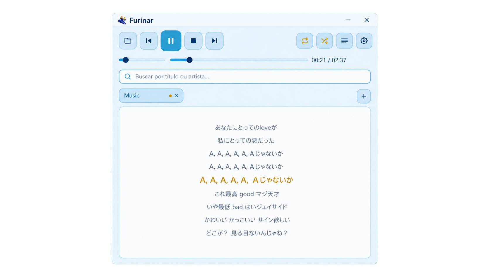
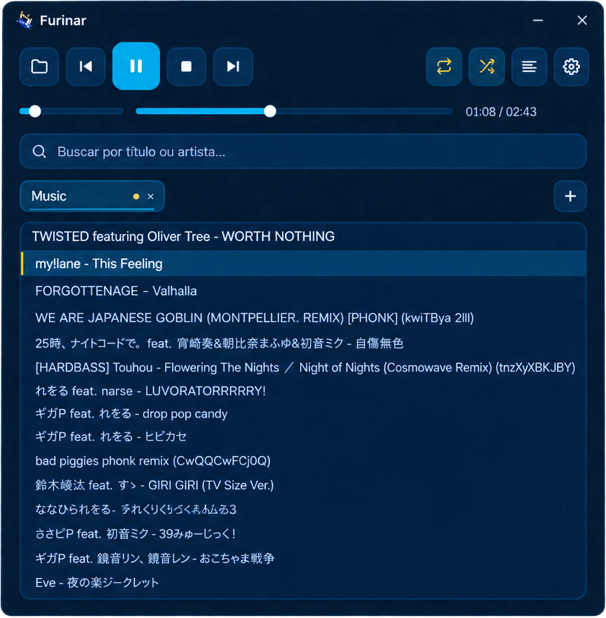

<div align="center">


# Furinar

**A light, fast, and beautiful audio player — inspired by the Hydro Archon.**


🇺🇸 English | [🇧🇷 Português](README.pt-BR.md)

</div>

---

<div align="center">

<!-- Screenshot 1: main player view (folder/tabs/playlist visible) -->


</div>

## Why Furinar?

Most desktop music players these days ship an entire browser engine just to play an MP3. Furinar does the opposite: it opens in milliseconds and sits in the background using **2 to 10 MB of RAM** — less than a single browser tab — while still covering everything a real player needs: tags, synced lyrics, multiple libraries, and native Windows integration.

The visual palette — deep navy, cyan, and gold (or baby blue and pearl white in light mode) — is a tribute to **Furina**, from *Genshin Impact*. No official affiliation, just a fan project.

## ✨ Features

**Playback**
- MP3, WAV, FLAC, OGG/Vorbis, and M4A support
- Play/Pause, Stop, Previous, Next, seeking, and volume control
- Loop (off / track / playlist) and Shuffle
- Automatically resumes the last track and position on reopen

**Organization**
- **Multiple folders as tabs** — open as many libraries as you want; switching tabs never interrupts what's currently playing
- Optional recursive subfolder scanning
- **ID3/Vorbis tag reading** (title and artist, falling back to the filename)
- Search/filter by title or artist, accent- and case-insensitive

**Extras**
- **Synced lyrics** via `.lrc` files, scrolling along with the track
- **Light/dark theme**, switched instantly, no restart needed
- Frameless window with a custom title bar (drag-to-move, Aero Snap, rounded corners on Windows 11)

<div align="center">

<!-- Screenshot 2: synced lyrics panel -->


</div>

**Windows integration**
- **Play/Pause, Previous, and Next** buttons right on the taskbar thumbnail preview
- System media controls (keyboard media keys, action center) via SMTC
- Keyboard shortcuts: `Space` play/pause, `←`/`→` seek ±5s, `↑`/`↓` navigate the list, `Enter` plays the selected track

<div align="center">
  <table>
    <tr>
      <td align="center"><b>Bright Theme</b></td>
      <td align="center"><b>Dark Theme</b></td>
    </tr>
    <tr>
      <td></td>
      <td></td>
    </tr>
  </table>
</div>

## 🚀 Getting started

### Windows

1. Download the latest `furinar.exe` (or build it — see below).
2. Open the app and click **Open folder** to point it at your music.
3. That's it — Furinar remembers everything on its own from then on.

### Linux

**Option 1 — Universal installer:**

```bash
curl -fsSL https://raw.githubusercontent.com/LokKol17/furinar/main/pkg/install.sh | bash
```

Or clone and install from source:

```bash
git clone https://github.com/LokKol17/furinar.git
cd furinar
make tarball
cd dist/furinar-*/
sudo ./install.sh --from-source
```

**Option 2 — Native packages:**

| Distro | Command |
|---|---|
| Debian/Ubuntu | `make deb && sudo dpkg -i dist/furinar_0.1.0_amd64.deb` |
| Fedora | `make rpm && sudo rpm -i dist/rpm/RPMS/x86_64/*.rpm` |
| Arch/Manjaro | `makepkg -si` (from `pkg/arch/PKGBUILD`) |

**Option 3 — cargo-deb:**

```bash
# Install cargo-deb
cargo install cargo-deb

# Build and generate .deb
cargo build --release
cargo deb
```

**System dependencies (all distros):**

| Distro | Install command |
|---|---|
| Debian/Ubuntu | `sudo apt install libasound2 libgtk-3-0` |
| Fedora | `sudo dnf install alsa-lib gtk3` |
| Arch/Manjaro | `sudo pacman -S alsa-lib gtk3` |

---

## For developers

<details>
<summary>Build and run</summary>

**Requirements:** Rust (edition 2024).

```bash
cargo run
```

Optimized build:

```bash
cargo build --release
```

The final binary lands at:
- **Windows:** `target/release/furinar.exe`
- **Linux:** `target/release/furinar`

**Packaging for Linux:**

```bash
make help          # See all available commands
make deb           # Generate .deb package (Debian/Ubuntu)
make rpm           # Generate .rpm package (Fedora)
make tarball       # Generate tarball with install script
```

**Creating a release:**

```bash
make release
# Upload files from dist/release/ to GitHub Releases
# Tag format: v0.1.0, v0.2.0, etc.
# Asset names: furinar-windows-x86_64.exe, furinar-linux-x86_64.tar.gz
```

</details>

<details>
<summary>App icon</summary>

The icon lives at `ui/assets/furinar_icon.png`. It doesn't need to be square: `build.rs` trims transparent edges and centers the content in a 256px square (preserving aspect ratio, no stretching), producing `ui/assets/furinar_icon_quadrado.png`. That derivative feeds both the window icon and the multi-resolution `.ico` (16/32/48/256) embedded in the executable.

To change the icon, just replace the source file — the build handles the rest.

</details>

<details>
<summary>Config file</summary>

Preferences are saved automatically to `furinar_config.json`, in the project root:

```json
{
  "pastas": ["E:\\Music"],
  "aba_visivel_salva": 0,
  "pasta_reproducao_salva": 0,
  "volume": 0.11666667,
  "modo_loop": 2,
  "shuffle": true,
  "indice_atual": 5,
  "tempo_atual": 42,
  "escanear_subpastas": true,
  "tema_claro": false
}
```

The old singular `pasta` field (from earlier versions) is still read: if `pastas` is empty and it exists, it's automatically migrated into the list on first run.

You can edit the file by hand — the player re-reads the config on every launch.

</details>

## 📄 License

Furinar's own source code is licensed under [BSD 3-Clause](LICENSE) — you're free to use, fork, and modify it, as long as credit is given and the license notice is kept.

Built with [Slint](https://slint.dev) under its Royalty-free License.

## 💙 Credits

Inspired by Furina, from *Genshin Impact* (HoYoverse). Furinar is a fan project with no official affiliation.

<a href="https://slint.dev"></a>
